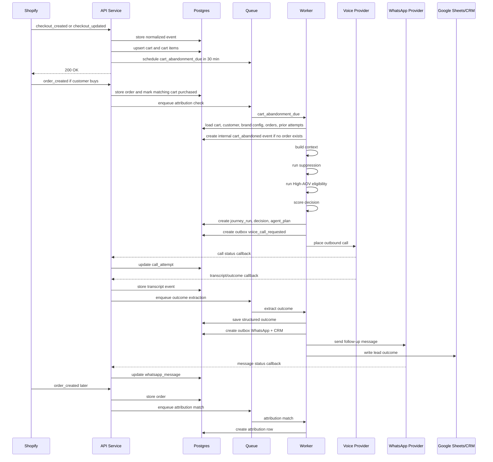

# Voice OS Build-Level Architecture

## Honest Status

The first architecture document is a good product and system blueprint. It is not, by itself, deep enough for engineering execution.

This document fills that gap. It makes concrete decisions about:

- Tech stack.
- Service boundaries.
- Database structure.
- Event model.
- State machine.
- API contracts.
- Queue and retry behavior.
- Provider adapter interfaces.
- Security, compliance, and observability.
- Exact first build path for High-AOV New Buyer.

Update: founder/product clarifications from 2026-05-23 are captured in `docs/ARCHITECTURE_CLARIFICATIONS.md`. Those decisions supersede any earlier assumptions that the product is Shopify-only, India-only, or simulation-only. The product is a Truffl web dashboard with connector install surfaces, multi-country/multi-currency support from day one, product-agnostic D2C journey setup, and real outbound voice calls.

The guiding decision is simple:

**Build a modular monolith first, not microservices.**

Voice OS has many modules, but the MVP should run as one API service, one worker service, one web dashboard, one database, and one queue. Split services later only when scale or team ownership forces it.

## Recommended Tech Stack

| Layer | Decision | Why |
| --- | --- | --- |
| Language | TypeScript | One language across dashboard, API, worker, shared domain logic |
| Dashboard | Next.js | Strong dashboard app structure, routing, server rendering, API-adjacent development |
| API service | Fastify | Lightweight, fast webhook/API server with schema validation and plugin structure |
| Worker service | BullMQ worker | Delayed jobs, retries, backoff, queue orchestration |
| Queue backend | Redis | Required queue backend for BullMQ |
| Primary database | PostgreSQL | Durable relational model for events, state, outcomes, attribution |
| ORM/migrations | Prisma | Clear schema, generated types, migrations, fast MVP iteration |
| Object storage | S3-compatible storage | Call recordings, long transcripts, exports |
| Auth | Truffl merchant org auth first, production RBAC later | Merchants use the Truffl dashboard even when they install through Shopify |
| Local dev | Docker Compose | Reproducible Postgres and Redis |
| Deployment | AWS-first production baseline | Voice sessions, webhooks, and workers need always-on infrastructure |

### Why Not Microservices Yet

Do not create separate services for connector hub, decision engine, agent compiler, attribution, and CRM writer in v1.

Use internal modules instead:

```txt
apps/
  web/
  api/
  worker/
packages/
  core/
  connectors/
  database/
  config/
```

This keeps the product understandable while the workflow is still changing.

This does not mean ignoring service boundaries. The code should keep clear module contracts for store connectors, voice providers, WhatsApp providers, journey orchestration, and attribution so these can be extracted later when scale or team ownership requires it.

Production baseline:

- API, worker, and voice runtime should run as containers on AWS ECS Fargate or an equivalent always-on container runtime.
- PostgreSQL should run on managed RDS.
- Redis should run on managed ElastiCache.
- Recordings, transcripts, and exports should live in S3.
- Secrets should live in AWS Secrets Manager.
- Logs, metrics, traces, and alerts should be production concerns from the first deploy.

Vercel can be used later for marketing or frontend convenience, but it should not own the core runtime for voice calls, workers, webhook delivery, or provider callbacks.

## Repository Shape

```txt
voiceos/
  apps/
    web/                  # Next.js dashboard
    api/                  # Fastify API and webhooks
    worker/               # BullMQ processors
  packages/
    core/
      journeys/
      decision/
      suppression/
      agent-compiler/
      attribution/
      journey-drafts/
      merchant-onboarding/
      crm/
      whatsapp/
      voice/
    connectors/
      shopify/
      woocommerce/
      custom-store/
      whatsapp/
      voice/
      sheets/
    database/
      prisma/
        schema.prisma
        migrations/
    config/
      env.ts
  docker-compose.yml
  package.json
```

## Runtime Services

### 1. Web Dashboard

Purpose:

- Provides the chat-driven journey setup surface.
- Converts plain-English requirements into draft journey configuration.
- Shows eligible carts.
- Shows journey runs.
- Reviews calls and outcomes.
- Shows WhatsApp and CRM sync status.
- Shows attribution and recovered revenue.
- Allows manual retry, suppress, or human handoff.

Runtime:

- Next.js app.
- Reads through API service, not directly from database in production.

The first dashboard screen should optimize for journey setup while still exposing operations, attribution, and debugging views as live visual feedback. Chat creates draft config patches; publishing a journey remains an explicit action.

### 2. API Service

Purpose:

- Receives provider webhooks.
- Exposes dashboard APIs.
- Handles merchant org, brand, connector, and journey draft APIs.
- Handles simulation endpoints.
- Validates webhook signatures.
- Writes normalized events.
- Enqueues jobs.

Runtime:

- Fastify service.
- Stateless.
- Horizontally scalable later.

### 3. Worker Service

Purpose:

- Processes delayed abandoned-cart evaluations.
- Builds context.
- Runs suppression and decisioning.
- Compiles agent plan.
- Dispatches calls, WhatsApp messages, CRM syncs.
- Performs attribution matching.
- Handles retries and provider side effects.

Runtime:

- BullMQ processors.
- Always on.
- Separate from API so webhooks remain fast.

Real calls are in scope for MVP. Simulation remains useful for setup and QA, but the architecture must support placing outbound calls to controlled India test numbers through Plivo before pilot launch. Twilio is the broader/global provider path.

### 4. Database

Purpose:

- Source of truth for carts, journey runs, decisions, outcomes, attribution, provider events, audit logs.

Runtime:

- PostgreSQL.
- Prisma migrations.

### 5. Redis

Purpose:

- Queue backend.
- Delayed jobs.
- Retry coordination.
- Short-lived locks.

Runtime:

- Redis.

## Event Model

All external events become internal normalized events.

Important correction: for Shopify, the internal `cart_abandoned` event should usually be created by Voice OS after a delay, not blindly trusted as a single incoming webhook.

### Event Envelope

```json
{
  "event_id": "evt_01H",
  "brand_id": "brand_001",
  "source": "shopify",
  "event_type": "checkout_updated",
  "external_id": "shopify_checkout_123",
  "idempotency_key": "shopify:checkout_updated:checkout_123:updated_at",
  "occurred_at": "2026-05-23T15:30:00+05:30",
  "received_at": "2026-05-23T15:30:04+05:30",
  "payload": {}
}
```

### Internal Event Types

| Event | Source | Meaning |
| --- | --- | --- |
| `checkout_created` | Shopify | Checkout/cart exists |
| `checkout_updated` | Shopify | Checkout/cart changed |
| `order_created` | Shopify | Purchase completed |
| `cart_abandonment_due` | Internal queue | It is time to evaluate abandoned cart |
| `cart_abandoned` | Internal | No order found after delay |
| `journey_eligible` | Internal | Cart matched a journey |
| `journey_suppressed` | Internal | Cart blocked by suppression |
| `voice_call_requested` | Internal | Call side effect requested |
| `voice_call_status` | Voice provider | Ringing, answered, completed, failed |
| `voice_transcript_ready` | Voice provider/runtime | Transcript available |
| `voice_outcome_extracted` | Internal | Structured call outcome saved |
| `whatsapp_message_requested` | Internal | WhatsApp side effect requested |
| `whatsapp_message_status` | WhatsApp provider | Sent, delivered, read, failed |
| `crm_sync_requested` | Internal | CRM side effect requested |
| `crm_sync_completed` | Internal | Outcome written to CRM/Sheet |
| `attribution_matched` | Internal | Order matched to journey run |

### Store Connector Contract

Every ecommerce platform must normalize into the internal event model.

Required platform capabilities:

- Connect store and persist credentials.
- Register or document event delivery.
- Receive cart/checkout created and updated signals.
- Receive order created/paid signals.
- Provide a recovery URL.
- Provide cart items, prices, currency, product identifiers, and customer/contact fields when available.
- Provide product catalog context or support catalog sync.

Shopify is the first implementation. WooCommerce and custom stores should use the same contract, not separate journey logic.

### Money And Markets

All money values must include:

- `amount_minor`
- `currency`
- Optional `presentment_amount_minor`
- Optional `presentment_currency`

High-AOV thresholds live in brand journey configuration and can vary by currency and market. No production rule should hardcode INR 10000.

## Exact High-AOV New Buyer Flow



## State Machine

### Journey Run States

| State | Meaning | Next States |
| --- | --- | --- |
| `waiting_window` | Cart exists but 30-minute window has not elapsed | `context_building`, `exited_purchased` |
| `context_building` | Worker is building full context | `suppressed`, `ineligible`, `decision_ready` |
| `suppressed` | Hard block matched | Terminal |
| `ineligible` | Did not match journey rules | Terminal |
| `decision_ready` | Decision has been saved | `agent_compiling` |
| `agent_compiling` | Agent plan being created | `call_queued`, `failed` |
| `call_queued` | Call side effect queued | `calling`, `failed` |
| `calling` | Provider has accepted call request | `call_connected`, `call_missed`, `call_failed` |
| `call_connected` | Customer answered | `outcome_extracting` |
| `call_missed` | Customer did not answer | `whatsapp_queued`, `retry_scheduled` |
| `call_failed` | Provider or network failed | `retry_scheduled`, `failed` |
| `outcome_extracting` | Transcript/status becoming structured outcome | `whatsapp_queued`, `human_handoff`, `completed_no_followup` |
| `whatsapp_queued` | Follow-up is queued | `whatsapp_sent`, `failed` |
| `whatsapp_sent` | Follow-up sent or accepted by provider | `crm_sync_queued` |
| `human_handoff` | Customer needs human | `crm_sync_queued` |
| `crm_sync_queued` | Outcome queued for CRM/Sheet | `crm_synced`, `failed` |
| `crm_synced` | Outcome written | `attribution_pending` |
| `attribution_pending` | Waiting for order match | `recovered`, `expired` |
| `recovered` | Order matched | Terminal |
| `expired` | Attribution window ended | Terminal |
| `failed` | Needs manual review or retry | Terminal or retry |
| `exited_purchased` | Customer bought before outreach | Terminal |

### State Transition Rule

Every transition must write:

- Previous state.
- New state.
- Reason.
- Actor: `api`, `worker`, `provider`, or `admin`.
- Timestamp.
- Correlation ID.

This makes debugging pilot issues much easier.

## Database Schema

This is the recommended v1 relational shape. Exact Prisma syntax can be generated from this.

### brands

| Column | Type | Notes |
| --- | --- | --- |
| id | uuid | Primary key |
| name | text | Brand name |
| timezone | text | Example: `Asia/Kolkata` |
| default_currency | text | Example: `INR` |
| status | text | `active`, `paused`, `archived` |
| created_at | timestamptz | Required |
| updated_at | timestamptz | Required |

### connectors

| Column | Type | Notes |
| --- | --- | --- |
| id | uuid | Primary key |
| brand_id | uuid | FK brands |
| type | text | `shopify`, `voice`, `whatsapp`, `sheets`, `crm` |
| provider | text | `shopify`, `twilio`, `exotel`, `wati`, `google_sheets` |
| status | text | `connected`, `degraded`, `disconnected` |
| config_json | jsonb | Non-secret provider config |
| secret_ref | text | Pointer to secret store |
| last_health_check_at | timestamptz | Nullable |
| created_at | timestamptz | Required |
| updated_at | timestamptz | Required |

Index:

- `(brand_id, type)`

### customers

| Column | Type | Notes |
| --- | --- | --- |
| id | uuid | Primary key |
| brand_id | uuid | FK brands |
| external_customer_id | text | Shopify customer ID |
| name | text | Nullable |
| email | text | Nullable |
| phone_e164 | text | Nullable |
| customer_type | text | `first_time`, `returning`, `unknown` |
| past_orders_count | int | Default 0 |
| tags_json | jsonb | Shopify/customer tags |
| created_at | timestamptz | Required |
| updated_at | timestamptz | Required |

Unique:

- `(brand_id, external_customer_id)`

Indexes:

- `(brand_id, phone_e164)`
- `(brand_id, email)`

### carts

| Column | Type | Notes |
| --- | --- | --- |
| id | uuid | Primary key |
| brand_id | uuid | FK brands |
| customer_id | uuid | FK customers, nullable |
| external_checkout_id | text | Shopify checkout ID/token |
| checkout_url | text | Recovery link |
| status | text | `open`, `abandoned`, `purchased`, `expired` |
| value_cents | int | Store minor units |
| currency | text | Example: `INR` |
| abandoned_at | timestamptz | Nullable until internal event |
| last_shopify_updated_at | timestamptz | Nullable |
| phone_e164 | text | Snapshot from checkout/customer |
| email | text | Snapshot |
| shipping_pincode | text | Nullable |
| raw_json | jsonb | Latest normalized cart payload |
| created_at | timestamptz | Required |
| updated_at | timestamptz | Required |

Unique:

- `(brand_id, external_checkout_id)`

Indexes:

- `(brand_id, status, value_cents)`
- `(brand_id, abandoned_at)`

### cart_items

| Column | Type | Notes |
| --- | --- | --- |
| id | uuid | Primary key |
| cart_id | uuid | FK carts |
| external_product_id | text | Shopify product ID |
| external_variant_id | text | Shopify variant ID |
| sku | text | Nullable |
| name | text | Required |
| variant_name | text | Nullable |
| category | text | Brand mapped |
| quantity | int | Required |
| price_cents | int | Required |
| metadata_json | jsonb | Product metadata |

Index:

- `(cart_id)`

### orders

| Column | Type | Notes |
| --- | --- | --- |
| id | uuid | Primary key |
| brand_id | uuid | FK brands |
| customer_id | uuid | FK customers, nullable |
| external_order_id | text | Shopify order ID |
| external_checkout_id | text | Shopify checkout token/ID if available |
| value_cents | int | Required |
| currency | text | Required |
| order_created_at | timestamptz | Required |
| raw_json | jsonb | Provider payload |
| created_at | timestamptz | Required |

Unique:

- `(brand_id, external_order_id)`

Indexes:

- `(brand_id, external_checkout_id)`
- `(brand_id, order_created_at)`

### events

| Column | Type | Notes |
| --- | --- | --- |
| id | uuid | Primary key |
| brand_id | uuid | FK brands |
| source | text | `shopify`, `voice`, `whatsapp`, `internal`, `admin` |
| event_type | text | Normalized event |
| external_id | text | Nullable |
| idempotency_key | text | Required |
| correlation_id | text | Request/job trace |
| occurred_at | timestamptz | Required |
| received_at | timestamptz | Required |
| payload_json | jsonb | Raw or normalized payload |

Unique:

- `(brand_id, idempotency_key)`

Indexes:

- `(brand_id, event_type, occurred_at)`
- `(correlation_id)`

### journey_configs

| Column | Type | Notes |
| --- | --- | --- |
| id | uuid | Primary key |
| brand_id | uuid | FK brands |
| journey_id | text | `high_aov_new_buyer` |
| active | boolean | Required |
| rules_json | jsonb | Thresholds, categories, attempts |
| agent_template_version | text | Required |
| whatsapp_template_ids_json | jsonb | Provider templates |
| crm_mapping_json | jsonb | Destination fields |
| created_at | timestamptz | Required |
| updated_at | timestamptz | Required |

Unique:

- `(brand_id, journey_id)`

### journey_runs

| Column | Type | Notes |
| --- | --- | --- |
| id | uuid | Primary key |
| brand_id | uuid | FK brands |
| cart_id | uuid | FK carts |
| journey_id | text | Required |
| state | text | Current state |
| started_at | timestamptz | Required |
| ended_at | timestamptz | Nullable |
| state_reason | text | Latest reason |
| context_snapshot_json | jsonb | Frozen context used for decision |
| created_at | timestamptz | Required |
| updated_at | timestamptz | Required |

Unique:

- `(cart_id, journey_id)`

Indexes:

- `(brand_id, journey_id, state)`
- `(brand_id, started_at)`

### state_transitions

| Column | Type | Notes |
| --- | --- | --- |
| id | uuid | Primary key |
| journey_run_id | uuid | FK journey_runs |
| from_state | text | Nullable for first state |
| to_state | text | Required |
| reason | text | Required |
| actor | text | `api`, `worker`, `provider`, `admin` |
| correlation_id | text | Required |
| created_at | timestamptz | Required |

Index:

- `(journey_run_id, created_at)`

### decisions

| Column | Type | Notes |
| --- | --- | --- |
| id | uuid | Primary key |
| journey_run_id | uuid | FK journey_runs |
| decision | text | `call_now`, `whatsapp_first`, `wait`, `suppress`, `human_handoff` |
| voice_score | int | Nullable if suppressed |
| reason_codes_json | jsonb | Explainability |
| suppression_reason | text | Nullable |
| created_at | timestamptz | Required |

Unique:

- `(journey_run_id)`

### agent_plans

| Column | Type | Notes |
| --- | --- | --- |
| id | uuid | Primary key |
| journey_run_id | uuid | FK journey_runs |
| agent_type | text | Required |
| template_version | text | Required |
| plan_json | jsonb | Structured agent plan |
| approved_claims_json | jsonb | Snapshot |
| restricted_claims_json | jsonb | Snapshot |
| created_at | timestamptz | Required |

Unique:

- `(journey_run_id)`

### call_attempts

| Column | Type | Notes |
| --- | --- | --- |
| id | uuid | Primary key |
| journey_run_id | uuid | FK journey_runs |
| provider | text | `twilio`, `exotel`, `plivo`, etc |
| provider_call_id | text | Nullable until accepted |
| attempt_number | int | Required |
| to_phone_e164 | text | Required |
| from_phone_e164 | text | Nullable |
| status | text | `queued`, `initiated`, `ringing`, `answered`, `completed`, `missed`, `failed` |
| started_at | timestamptz | Nullable |
| ended_at | timestamptz | Nullable |
| recording_url | text | Nullable |
| transcript_object_key | text | Nullable |
| provider_payload_json | jsonb | Latest callback |
| created_at | timestamptz | Required |
| updated_at | timestamptz | Required |

Indexes:

- `(journey_run_id, attempt_number)`
- `(provider, provider_call_id)`

### call_outcomes

| Column | Type | Notes |
| --- | --- | --- |
| id | uuid | Primary key |
| journey_run_id | uuid | FK journey_runs |
| call_attempt_id | uuid | FK call_attempts |
| call_status | text | `connected`, `missed`, `failed` |
| lead_status | text | `qualified_hot`, `warm`, `cold`, `handoff`, `opted_out` |
| primary_objection | text | Nullable |
| intent | text | `high`, `medium`, `low`, `unknown` |
| urgency | text | `today`, `this_week`, `later`, `unknown` |
| human_handoff_required | boolean | Required |
| next_best_action | text | Required |
| summary | text | Required |
| confidence | numeric | Nullable |
| created_at | timestamptz | Required |

Unique:

- `(journey_run_id)`

### whatsapp_messages

| Column | Type | Notes |
| --- | --- | --- |
| id | uuid | Primary key |
| journey_run_id | uuid | FK journey_runs |
| provider | text | Required |
| provider_message_id | text | Nullable |
| to_phone_e164 | text | Required |
| template_id | text | Required |
| variables_json | jsonb | Required |
| status | text | `queued`, `sent`, `delivered`, `read`, `failed` |
| sent_at | timestamptz | Nullable |
| provider_payload_json | jsonb | Latest callback |
| created_at | timestamptz | Required |
| updated_at | timestamptz | Required |

Indexes:

- `(journey_run_id)`
- `(provider, provider_message_id)`

### crm_syncs

| Column | Type | Notes |
| --- | --- | --- |
| id | uuid | Primary key |
| journey_run_id | uuid | FK journey_runs |
| destination | text | `google_sheets`, `hubspot`, `zoho` |
| status | text | `queued`, `success`, `failed` |
| payload_json | jsonb | Outcome payload |
| external_record_id | text | Nullable |
| error_message | text | Nullable |
| created_at | timestamptz | Required |
| updated_at | timestamptz | Required |

Index:

- `(journey_run_id, destination)`

### suppressions

| Column | Type | Notes |
| --- | --- | --- |
| id | uuid | Primary key |
| brand_id | uuid | FK brands |
| customer_id | uuid | FK customers, nullable |
| phone_e164 | text | Nullable |
| reason | text | `dnd`, `opt_out`, `manual`, `too_many_attempts` |
| source | text | `whatsapp`, `voice`, `admin`, `provider` |
| active | boolean | Required |
| created_at | timestamptz | Required |

Indexes:

- `(brand_id, phone_e164, active)`
- `(brand_id, customer_id, active)`

### attributions

| Column | Type | Notes |
| --- | --- | --- |
| id | uuid | Primary key |
| journey_run_id | uuid | FK journey_runs |
| order_id | uuid | FK orders |
| attribution_type | text | `direct`, `assisted`, `influenced` |
| basis | text | `checkout_id`, `phone`, `email`, `customer_id` |
| matched_at | timestamptz | Required |
| revenue_cents | int | Required |

Unique:

- `(journey_run_id, order_id)`

### outbox_messages

Use outbox for side effects so a DB transaction cannot be lost after a crash.

| Column | Type | Notes |
| --- | --- | --- |
| id | uuid | Primary key |
| brand_id | uuid | FK brands |
| journey_run_id | uuid | Nullable |
| type | text | `voice_call`, `whatsapp_message`, `crm_sync`, `attribution_check` |
| status | text | `pending`, `processing`, `sent`, `failed` |
| payload_json | jsonb | Required |
| idempotency_key | text | Required |
| attempts | int | Default 0 |
| available_at | timestamptz | Required |
| last_error | text | Nullable |
| created_at | timestamptz | Required |
| updated_at | timestamptz | Required |

Unique:

- `(brand_id, idempotency_key)`

Indexes:

- `(status, available_at)`
- `(journey_run_id)`

## Queue Design

### Queues

| Queue | Purpose |
| --- | --- |
| `cart-evaluation` | Delayed 30-minute abandoned cart evaluation |
| `journey-orchestration` | Context, suppression, decision, state transitions |
| `voice-dispatch` | Place outbound calls |
| `outcome-processing` | Transcript to structured outcome |
| `whatsapp-dispatch` | Send WhatsApp templates |
| `crm-sync` | Write CRM/Sheets |
| `attribution` | Match Shopify orders to journey runs |

### Job Idempotency

Use deterministic job IDs:

```txt
cart-evaluation:{brand_id}:{external_checkout_id}
voice-dispatch:{journey_run_id}:attempt:{attempt_number}
whatsapp-dispatch:{journey_run_id}:{template_type}
crm-sync:{journey_run_id}:{destination}
attribution:{brand_id}:{external_order_id}
```

### Retry Rules

| Job | Retry | Backoff |
| --- | --- | --- |
| Shopify fetch/context build | 3 attempts | Exponential, 30s base |
| Voice dispatch | 2 attempts | Exponential, 60s base |
| WhatsApp dispatch | 3 attempts | Exponential, 30s base |
| CRM sync | 5 attempts | Exponential, 60s base |
| Attribution match | 3 attempts | 5 min, 30 min, 2 hours |

External side effects must be idempotent when provider supports it. If a provider does not support idempotency, keep the outbox row as the local protection.

## API Contracts

### Public Webhooks

| Route | Purpose |
| --- | --- |
| `POST /webhooks/shopify` | Shopify checkout/order events |
| `POST /webhooks/voice/:provider` | Voice status/transcript callbacks |
| `POST /webhooks/whatsapp/:provider` | WhatsApp message callbacks |
| `POST /webhooks/journey-tool/:provider` | P1 marketing journey triggers |

Rules:

- Return quickly.
- Verify signature before processing.
- Store event first.
- Enqueue jobs after durable write.
- Never execute long work inside webhook request.

### Dashboard APIs

| Route | Purpose |
| --- | --- |
| `GET /api/metrics/overview` | Recovered revenue, calls, conversions |
| `GET /api/carts?journey_id=high_aov_new_buyer` | Eligible or evaluated carts |
| `GET /api/journey-runs` | Journey run table |
| `GET /api/journey-runs/:id` | Full run detail |
| `GET /api/journey-runs/:id/timeline` | State transitions and provider events |
| `POST /api/journey-runs/:id/retry-call` | Manual retry |
| `POST /api/journey-runs/:id/suppress` | Manual suppression |
| `POST /api/journey-runs/:id/handoff` | Assign human owner |
| `GET /api/call-review` | Calls requiring review |
| `GET /api/objections` | Objection analytics |
| `GET /api/attribution` | Revenue attribution table |

### Simulation APIs

These are important for the first build.

| Route | Purpose |
| --- | --- |
| `POST /api/simulate/high-aov-cart` | Create sample INR 18000 cart |
| `POST /api/simulate/run-due-jobs` | Advance delayed journey in dev |
| `POST /api/simulate/call-outcome` | Inject connected/missed/failed outcome |
| `POST /api/simulate/order-created` | Test attribution |

## Provider Adapter Interfaces

The system should not leak provider-specific shapes into journey logic.

### Shopify Adapter

```ts
interface ShopifyAdapter {
  verifyWebhook(headers: Record<string, string>, rawBody: Buffer): Promise<boolean>;
  normalizeWebhook(rawBody: unknown): Promise<NormalizedEvent>;
  fetchCheckout(brandId: string, checkoutId: string): Promise<CartSnapshot>;
  fetchCustomer(brandId: string, customerId: string): Promise<CustomerSnapshot>;
  fetchProductMetadata(brandId: string, productIds: string[]): Promise<ProductSnapshot[]>;
}
```

### Voice Adapter

```ts
interface VoiceAdapter {
  placeOutboundCall(input: PlaceCallInput): Promise<PlaceCallResult>;
  verifyWebhook(headers: Record<string, string>, rawBody: Buffer): Promise<boolean>;
  normalizeStatusCallback(rawBody: unknown): Promise<VoiceStatusEvent>;
  normalizeTranscriptCallback(rawBody: unknown): Promise<VoiceTranscriptEvent>;
}
```

Important voice architecture decision:

- Keep telephony and conversation runtime abstracted.
- Provider may be a managed AI voice platform, or telephony plus a separate AI runtime.
- The journey code should only know `placeOutboundCall`, status events, transcript events, and outcome extraction.

### WhatsApp Adapter

```ts
interface WhatsAppAdapter {
  sendTemplateMessage(input: SendTemplateInput): Promise<SendTemplateResult>;
  verifyWebhook(headers: Record<string, string>, rawBody: Buffer): Promise<boolean>;
  normalizeMessageStatus(rawBody: unknown): Promise<WhatsAppStatusEvent>;
}
```

### CRM Adapter

```ts
interface CrmAdapter {
  writeOutcome(input: CrmOutcomePayload): Promise<CrmWriteResult>;
}
```

Google Sheets is the first CRM adapter because it is fastest for pilots.

## Decision Logic

### High-AOV New Buyer Rules

```ts
const HIGH_AOV_NEW_BUYER_RULES = {
  waitMinutes: 30,
  minimumCartValueCents: 1000000,
  currency: "INR",
  customerType: "first_time",
  requirePhone: true,
  requireNotPurchased: true,
  maxCallAttemptsLast7Days: 2,
  highConsiderationCategories: [
    "mattress",
    "furniture",
    "appliances",
    "electronics",
    "jewelry",
    "premium_health",
    "premium_fashion"
  ]
};
```

Note: INR 10000 is stored as `1000000` minor units if using paise.

### Suppression Order

Run suppression before scoring.

1. Already purchased.
2. DND.
3. Explicit opt-out.
4. Invalid phone.
5. Phone missing.
6. Too many attempts.
7. Brand journey disabled.
8. Outside allowed calling window.

If any hard suppression matches, do not call.

### Scoring

```ts
function scoreHighAovNewBuyer(context: JourneyContext): DecisionScore {
  let score = 0;
  const reasons: string[] = [];

  if (context.cart.valueCents >= 1000000) {
    score += 30;
    reasons.push("cart_value_high");
  }

  if (context.customer.customerType === "first_time") {
    score += 15;
    reasons.push("first_time_buyer");
  }

  if (context.cart.items.some(item => context.brandConfig.highConsiderationCategories.includes(item.category))) {
    score += 20;
    reasons.push("high_consideration_category");
  }

  if (context.customer.phoneE164) {
    score += 15;
    reasons.push("phone_available");
  }

  if (context.compliance.whatsappOptIn) {
    score += 10;
    reasons.push("whatsapp_opt_in");
  }

  if (context.offer?.eligible) {
    score += 5;
    reasons.push("offer_available");
  }

  if (context.delivery?.pincode) {
    score += 5;
    reasons.push("pincode_available");
  }

  return { score, reasons };
}
```

For v1:

- Score 80 or above: `call_now`.
- Score 60 to 79: `whatsapp_first` or manual review.
- Below 60: `suppress` or non-voice nudge.

Eligibility rules are still primary. The score is for explainability and later tuning.

## Agent Compiler Design

Do not let the model freely invent a call script.

The agent compiler should assemble a structured plan from:

- Journey template.
- Product category playbook.
- Brand-approved claims.
- Restricted claims.
- Offer rules.
- Delivery facts.
- Customer/cart context.

### Agent Plan Schema

```json
{
  "agent_type": "high_aov_new_buyer_recovery",
  "template_version": "2026-05-23.v1",
  "language": "en-IN",
  "opening": "",
  "allowed_claims": [],
  "restricted_claims": [],
  "qualification_questions": [],
  "objection_playbooks": {},
  "actions": [],
  "handoff_rules": [],
  "compliance_rules": [],
  "closing_rules": []
}
```

### Required Guardrails

- Never say "you abandoned your cart."
- Never invent discounts.
- Never invent delivery dates.
- Never make medical, cure, or guaranteed outcome claims.
- Never pressure the customer.
- Offer human handoff for detailed product advice.
- Capture opt-out and mark suppression immediately.

## Outcome Extraction

Outcome extraction should return strict JSON.

```json
{
  "call_status": "connected",
  "lead_status": "qualified_hot",
  "primary_objection": "product_suitability",
  "intent": "high",
  "urgency": "this_week",
  "human_handoff_required": false,
  "next_best_action": "send_cart_link_on_whatsapp",
  "summary": "Customer wanted help confirming suitability and warranty. Checkout link and offer sent.",
  "confidence": 0.86
}
```

If confidence is low, mark the call for review before writing final CRM outcome.

## WhatsApp Message Rules

WhatsApp templates should be deterministic and provider-approved.

### Template Selection

| Trigger | Template |
| --- | --- |
| Connected and interested | `high_aov_after_call_cart_link` |
| Price objection and offer eligible | `high_aov_offer_cart_link` |
| Delivery objection | `high_aov_delivery_eta` |
| Product suitability | `high_aov_product_help_summary` |
| Missed call | `high_aov_missed_call_nudge` |
| Human handoff | `high_aov_human_handoff` |
| Opt-out | `opt_out_confirmation` |

### Template Variables

Always use explicit variables:

- `customer_name`
- `product_name`
- `checkout_url`
- `offer_code`
- `policy_summary`
- `warranty_summary`
- `eta_text`
- `support_phone`

Do not send freeform model-generated WhatsApp text in v1.

## Attribution Logic

### Matching Priority

1. Same Shopify checkout ID.
2. Same Shopify customer ID.
3. Same phone number.
4. Same email.

Checkout ID match is strongest. Phone/email matches should be marked lower confidence.

### Attribution Windows

| Type | Window |
| --- | --- |
| Direct | Order within 24 hours of call connected or WhatsApp link clicked |
| Assisted | Order within 72 hours of intervention |
| Influenced | Order within 7 days of intervention |

Dashboard must show these separately.

### Revenue Rule

Only count the order value once. If multiple journey runs match one order, choose the strongest and most recent match.

## Security and Compliance

### Security Requirements

- Verify every provider webhook signature.
- Store raw webhook payloads but redact secrets.
- Encrypt provider credentials or store them in a secret manager.
- Use role-based access for dashboard once pilots expand.
- Never expose customer phone/email in logs unless masked.
- Use audit logs for manual suppression, retry, handoff, and config changes.

### Compliance Requirements

- DND and opt-out suppression from day one.
- Calling hours configurable by brand and region.
- Call attempt cap.
- Recording disclosure configurable by brand/legal requirement.
- Approved claims only.
- Opt-out capture from voice and WhatsApp.
- Manual review path for low-confidence outcomes.

Legal/compliance signoff is still required before live calls. The system architecture can enforce rules, but it does not replace legal review.

## Observability

### Logs

Every log line should include:

- `brand_id`
- `journey_run_id` when available
- `cart_id` when available
- `correlation_id`
- `provider`
- `event_type`

### Metrics

| Metric | Why |
| --- | --- |
| Webhook receive count by source | Connector health |
| Event dedupe count | Idempotency health |
| Queue depth by queue | Worker health |
| Job retry/failure count | Reliability |
| Calls requested/connected/missed/failed | Voice quality |
| WhatsApp sent/delivered/failed | Follow-up quality |
| CRM sync success rate | Ops reliability |
| Suppression count by reason | Compliance and tuning |
| Attribution match count | Revenue proof |

### Alerts

Alert on:

- Webhook signature failures spike.
- Queue delay above threshold.
- Voice dispatch failure rate above threshold.
- WhatsApp send failure rate above threshold.
- CRM sync failure rate above threshold.
- Attribution job failing repeatedly.

## Dashboard Detail

### Page 1: Overview

Cards:

- Eligible high-AOV carts.
- Calls placed.
- Connect rate.
- Qualified hot leads.
- WhatsApp follow-ups sent.
- Direct recovered revenue.
- Assisted recovered revenue.

### Page 2: Journey Runs

Table columns:

- Customer.
- Cart value.
- Product/category.
- Current state.
- Voice score.
- Decision.
- Call status.
- Primary objection.
- Next action.
- Revenue status.

Actions:

- View timeline.
- Retry call.
- Suppress.
- Mark human handoff.

### Page 3: Run Detail

Sections:

- Context snapshot.
- Decision reason codes.
- Agent plan.
- Call attempts.
- Transcript/summary.
- WhatsApp payload and status.
- CRM payload and sync status.
- Attribution status.
- Full event timeline.

### Page 4: Call Review

Filters:

- Low confidence.
- Human handoff.
- Opt-out.
- Failed outcome extraction.
- High-value carts.

### Page 5: Objections

Charts/tables:

- Objection by category.
- Objection by product.
- Objection by cart value band.
- Objection to conversion rate.

## Testing Strategy

### Unit Tests

- Suppression rules.
- High-AOV eligibility.
- Scoring.
- Agent plan generation.
- WhatsApp template selection.
- Attribution matching.

### Integration Tests

- Shopify webhook normalization.
- Event dedupe.
- Cart evaluation after delay.
- Journey run state transitions.
- Outbox dispatch.
- CRM sync.

### End-to-End Simulation Tests

1. Create high-AOV abandoned cart.
2. Advance delay.
3. Verify journey run created.
4. Verify decision is `call_now`.
5. Verify agent plan generated.
6. Inject connected call outcome.
7. Verify WhatsApp message queued.
8. Verify CRM payload created.
9. Inject order event.
10. Verify direct attribution.

## Build Milestones

### Milestone 1: Local Journey Simulator

Goal:

Prove the full workflow without live integrations.

Build:

- Database schema.
- Static brand config.
- Static sample cart.
- Simulated checkout event.
- Cart evaluation worker.
- Decision engine.
- Agent compiler.
- Mock call outcome.
- Mock WhatsApp and CRM records.
- Dashboard views.

Done when:

- Clicking "simulate high-AOV cart" produces a full journey run from cart to CRM payload.

### Milestone 2: Shopify Ingestion

Goal:

Replace simulated cart input with real Shopify events.

Build:

- Shopify webhook receiver.
- Signature validation.
- Checkout/cart upsert.
- Order webhook.
- Internal abandonment detection.
- Attribution from order events.

Done when:

- Real checkout/order events drive journey state without manual input.

### Milestone 3: Voice Provider

Goal:

Replace mock call with outbound call provider.

Build:

- Voice adapter.
- Call dispatch outbox.
- Status callback.
- Transcript callback.
- Retry policy.

Done when:

- A journey run can trigger a real call and update status from provider callbacks.

### Milestone 4: WhatsApp and Sheets

Goal:

Send real follow-up and write real outcome.

Build:

- WhatsApp adapter.
- Approved templates.
- Message status callback.
- Google Sheets writer.
- CRM sync retries.

Done when:

- Connected/missed call outcomes trigger provider-approved WhatsApp messages and Sheet rows.

### Milestone 5: Pilot Hardening

Goal:

Run with a closed pilot brand safely.

Build:

- Admin auth.
- Connector health.
- Config UI.
- Suppression UI.
- Manual retry/handoff.
- Observability and alerts.
- Call review queue.

Done when:

- A brand can run the High-AOV New Buyer journey with operational visibility and safety controls.

## Decisions Still Requiring Business Input

These are not purely technical decisions:

| Decision | Why It Matters |
| --- | --- |
| Voice provider | Depends on India calling, pricing, DND support, recording, AI runtime needs |
| WhatsApp provider | Depends on existing brand stack and approved templates |
| CRM destination | Google Sheets is easiest, but pilots may require HubSpot/Zoho/LeadSquared |
| Calling hours | Depends on brand policy and region |
| Offer rules | Must be brand-approved to protect margin |
| Approved product claims | Must come from brand, not generated by AI |
| Recording disclosure | Requires legal/compliance input |
| Human handoff owner | Needs brand ops workflow |

The architecture can support these choices, but the pilot must decide them.

## First Build Checklist

Build in this order:

1. `schema.prisma` with the tables above.
2. Seed one brand and one High-AOV journey config.
3. Add simulation endpoint for checkout event.
4. Add event store and idempotency handling.
5. Add cart upsert and delayed evaluation job.
6. Add context builder.
7. Add suppression engine.
8. Add High-AOV eligibility and scoring.
9. Add journey run state machine.
10. Add agent compiler.
11. Add mock voice dispatch and mock outcome.
12. Add WhatsApp message record generation.
13. Add CRM payload generation.
14. Add mock order event and attribution.
15. Add dashboard overview and journey detail.

## Stack References

- Next.js App Router and route handlers: https://nextjs.org/docs/app
- Fastify documentation: https://fastify.dev/docs/latest/
- Prisma PostgreSQL and migrations: https://www.prisma.io/docs/orm
- BullMQ queues, delayed jobs, and retries: https://docs.bullmq.io/
- PostgreSQL constraints and indexes: https://www.postgresql.org/docs/current/ddl-constraints.html
- Shopify webhooks: https://shopify.dev/docs/apps/build/webhooks
- Shopify abandoned checkouts resource: https://shopify.dev/docs/api/admin-rest/latest/resources/abandoned-checkouts
- Twilio voice status callbacks: https://www.twilio.com/docs/voice/twiml/client/status-callbacks

## Bottom Line

This is deep enough to start building a serious MVP.

The first document answers "what is the system?"

This document answers "how do we build it?"

The only remaining decisions are vendor/business choices that require pilot context, especially voice provider, WhatsApp provider, calling policy, offer policy, and approved product claims.
