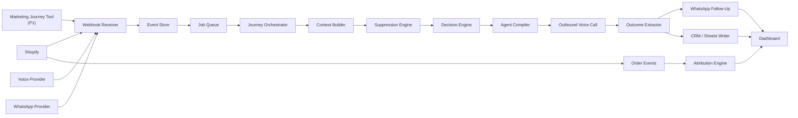
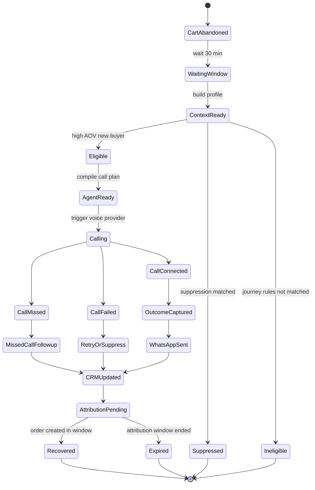
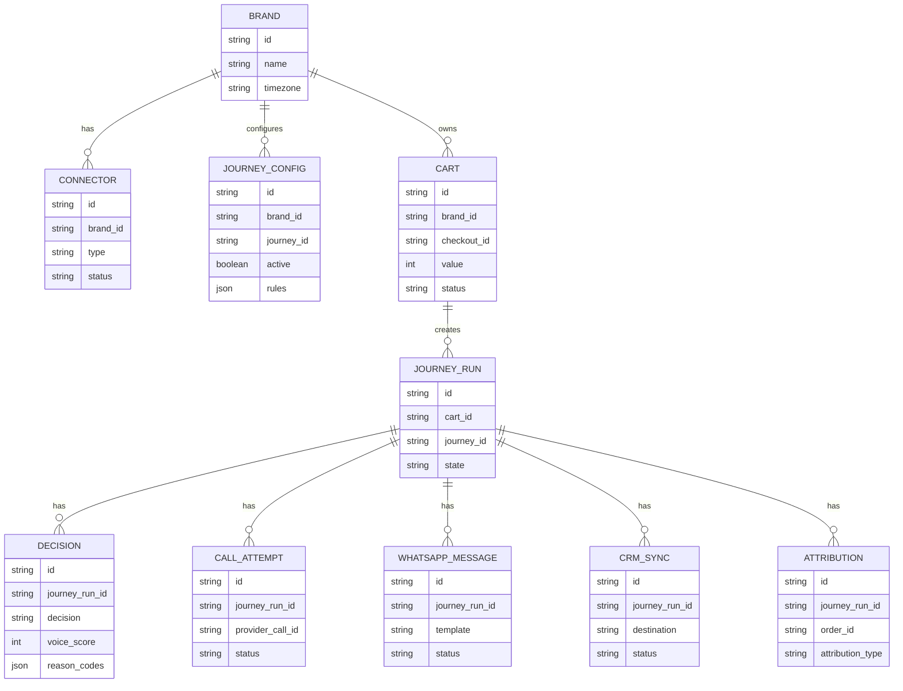

# Voice OS Architecture

## Scope

This architecture defines the first buildable version of Voice OS for D2C abandoned cart recovery.

Update: product and connector decisions clarified on 2026-05-23 are captured in `docs/ARCHITECTURE_CLARIFICATIONS.md`. In short, Truffl is a merchant-facing SaaS dashboard with store connectors. Shopify is the first connector and install surface, not the whole product.

The platform architecture is intentionally journey-agnostic, but the first implementation is focused on one journey:

**High-AOV New Buyer Cart Recovery**

The goal is to recover high-value abandoned carts by detecting eligible Shopify checkouts, deciding whether a voice call is appropriate, generating a safe product-specific call plan, executing the intervention, sending WhatsApp follow-up, updating CRM or Sheets, and attributing recovered orders.

## Architecture Principle

Build a reusable Voice OS spine, then plug the High-AOV New Buyer journey into it.

The system must be product-agnostic across D2C categories. It should not be hardcoded as "mattress cart recovery", but it also should not become a fully generic journey builder in v1. The right v1 shape is:

- Generic event ingestion.
- Generic customer/cart context builder.
- Generic suppression and scoring framework.
- Journey-specific eligibility rules.
- Journey-specific agent template.
- Journey-specific WhatsApp and CRM outcomes.
- Shared dashboard and attribution layer.

## High-Level System



## Core Modules

| Module | Responsibility | MVP Behavior |
| --- | --- | --- |
| Connector Hub | Stores credentials, connector health, webhook setup, provider configuration | Shopify, WhatsApp, voice provider, Google Sheets |
| Webhook Receiver | Receives events from Shopify, voice provider, WhatsApp, and future journey tools | Validates, normalizes, deduplicates events |
| Event Store | Keeps every inbound and outbound event for replay and audit | Stores normalized event payloads and idempotency keys |
| Job Queue | Runs delayed and retryable work | Waits 30 minutes after cart abandonment before evaluating |
| Context Builder | Builds the customer/cart profile | Pulls cart, customer, product, offer, phone, pincode, past orders |
| Suppression Engine | Blocks unsafe or unwanted outreach | DND, opt-out, no phone, already purchased, too many attempts |
| Decision Engine | Decides call vs WhatsApp vs suppress | High-AOV New Buyer calls if eligible |
| Agent Compiler | Generates call plan, guardrails, actions, and follow-up rules | Uses deterministic templates plus approved brand/product knowledge |
| Voice Execution Layer | Places outbound call and receives status/transcript | Integrates with Exotel, Twilio, Plivo, or equivalent |
| Outcome Extractor | Converts transcript/call status into structured outcome | Objection, intent, urgency, handoff, next action |
| WhatsApp Follow-Up | Sends post-call or missed-call message | Sends cart link, coupon if eligible, ETA, warranty/policy summary |
| CRM / Sheets Writer | Logs the lead outcome | Writes standard CRM payload to Google Sheets first |
| Attribution Engine | Tracks recovered revenue | Matches Shopify order events to prior journey interventions |
| Dashboard | Shows operations and revenue metrics | Eligible carts, calls, outcomes, objections, recovered revenue |

## MVP Integration Set

Start with the smallest connector set that proves the product.

| Layer | MVP Provider | Purpose |
| --- | --- | --- |
| Storefront | Shopify first, connector contract for other stores | Abandoned checkout, customer, cart, product, order events |
| Voice | Exotel, Twilio, or Plivo | Outbound call, call status, recording, transcript |
| WhatsApp | Interakt, WATI, Zoko, or WhatsApp Cloud API | Cart link and post-call follow-up |
| CRM | Google Sheets | Fast pilot-friendly outcome logging |
| Dashboard | Internal web app | Journey visibility and call review |

P1 connectors can include Shiprocket for ETA, Razorpay/Cashfree for payment links, and HubSpot/Zoho/LeadSquared for CRM.

## High-AOV New Buyer Journey

### Eligibility

A cart is eligible for this journey when all conditions are true:

| Rule | MVP Value |
| --- | --- |
| Event type | `cart_abandoned` |
| Wait time | 30 minutes after abandonment |
| Cart value | Brand-configured threshold per currency and market |
| Customer type | First-time buyer |
| Phone | Valid phone available |
| Product category | High-consideration category |
| Purchase status | No order created after abandonment |
| Suppression | Not DND, not opted out, not over attempt limit |

### High-Consideration Products

For v1, define high-consideration products through brand-configured rules rather than hardcoded categories or unreviewed AI inference.

Examples of rule inputs:

- Product collections.
- Product tags.
- Product type.
- Price bands.
- Vendor.
- SKU or variant lists.
- Brand-uploaded product notes.

### Journey Flow



## Decision Engine

The decision engine should be rules-first in MVP.

### Decision Output

```json
{
  "journey_id": "high_aov_new_buyer",
  "decision": "call_now",
  "voice_score": 87,
  "reason_codes": [
    "cart_value_high",
    "first_time_buyer",
    "phone_available",
    "high_consideration_category"
  ],
  "suppression_reason": null,
  "next_action": "compile_voice_agent"
}
```

### Decision Actions

| Decision | Meaning |
| --- | --- |
| `call_now` | Eligible for immediate outbound call |
| `whatsapp_first` | Send WhatsApp before call |
| `wait` | Delay and re-check |
| `suppress` | Do not contact |
| `human_handoff` | Assign to human owner |

### MVP Scoring

Use scoring for explainability, not prediction.

| Factor | Score Impact |
| --- | --- |
| Cart value greater than or equal to INR 10000 | +30 |
| First-time buyer | +15 |
| High-consideration category | +20 |
| Phone available | +15 |
| WhatsApp opt-in | +10 |
| Eligible offer exists | +5 |
| Delivery pincode available | +5 |
| DND or opt-out | Hard suppress |
| Already purchased | Hard suppress |
| Too many recent attempts | Hard suppress |

Suggested threshold:

- `80+`: call now.
- `60-79`: WhatsApp first or call during preferred window.
- `<60`: suppress or non-voice nudge.

For the first journey, eligibility rules matter more than the score. A score is useful for dashboard clarity and later tuning.

## Context Object

The context object is the shared input to decisioning, agent compilation, WhatsApp follow-up, CRM update, and attribution.

```json
{
  "brand_id": "brand_001",
  "journey_id": "high_aov_new_buyer",
  "customer": {
    "id": "shopify_customer_123",
    "name": "Riya",
    "phone": "+91XXXXXXXXXX",
    "email": "riya@example.com",
    "customer_type": "first_time",
    "past_orders_count": 0,
    "tags": []
  },
  "cart": {
    "id": "checkout_123",
    "abandoned_at": "2026-05-23T15:30:00+05:30",
    "value": 18000,
    "currency": "INR",
    "checkout_url": "https://brand.com/checkouts/123",
    "items": [
      {
        "product_id": "prod_001",
        "name": "Orthopedic Mattress",
        "variant": "Queen Size",
        "category": "mattress",
        "price": 18000,
        "quantity": 1
      }
    ]
  },
  "delivery": {
    "pincode": "122001",
    "eta": null,
    "cod_available": null
  },
  "offer": {
    "eligible": true,
    "code": "SLEEP10",
    "description": "10 percent off",
    "expires_at": "2026-05-23T23:59:59+05:30"
  },
  "compliance": {
    "dnd": false,
    "opted_out": false,
    "whatsapp_opt_in": true,
    "call_attempts_last_7_days": 0
  },
  "brand_config": {
    "tone": "helpful, concise, premium",
    "approved_claims": [
      "10-year warranty",
      "orthopedic support",
      "free delivery where serviceable"
    ],
    "restricted_claims": [
      "medical cure claims",
      "guaranteed pain relief"
    ],
    "handoff_phone": "+91XXXXXXXXXX"
  }
}
```

## Agent Compiler

The v1 agent compiler should produce a structured call plan, not an open-ended prompt blob.

### Agent Compiler Inputs

- Brand tone.
- Product category.
- Cart item details.
- Approved product claims.
- Restricted claims.
- Offer eligibility.
- Delivery data.
- Customer type.
- Suppression and compliance rules.
- Human handoff criteria.

### Agent Plan Output

```json
{
  "agent_type": "high_aov_new_buyer_recovery",
  "opening": "Hi Riya, this is an assistant from Brand. I noticed you were exploring the orthopedic mattress and wanted to check if I can help with size, comfort, delivery, or payment before you decide.",
  "qualification_questions": [
    "Are you buying this for yourself or someone else?",
    "Is your main concern comfort, back support, delivery time, or price?",
    "Would you like me to send the checkout link on WhatsApp?"
  ],
  "objection_playbooks": {
    "product_suitability": [
      "Ask sleep preference and size need.",
      "Share only approved support and warranty claims.",
      "Offer human handoff if customer needs detailed recommendation."
    ],
    "delivery_timeline": [
      "Use ETA if available.",
      "If ETA is unavailable, say the team can confirm exact delivery."
    ],
    "price": [
      "Mention eligible offer only if configured.",
      "Do not invent discounts."
    ],
    "trust": [
      "Share warranty, return/exchange policy, and support availability."
    ]
  },
  "guardrails": [
    "Do not say the customer abandoned the cart.",
    "Do not invent product claims.",
    "Do not promise delivery dates unless provided by connector data.",
    "Do not pressure the customer.",
    "Offer opt-out when customer asks not to be contacted."
  ],
  "actions": [
    "send_checkout_link",
    "send_offer_if_eligible",
    "send_policy_summary",
    "create_human_handoff"
  ]
}
```

## Voice Call Handling

### Call Outcomes

| Outcome | System Action |
| --- | --- |
| Connected, interested | Send checkout link, offer if eligible, CRM qualified hot |
| Connected, has objection | Send relevant reassurance, CRM with objection |
| Connected, wants human | Assign human handoff, send context |
| Connected, not interested | Mark cold, suppress retries |
| Missed call | Send polite WhatsApp follow-up |
| Failed call | Retry based on retry policy |
| Opt-out requested | Suppress future outreach |

### Retry Policy

For High-AOV New Buyer v1:

- Attempt 1: 30 minutes after abandonment.
- Attempt 2: 4 to 6 hours later if no answer and no purchase.
- Attempt 3: next day during allowed calling hours, optional.
- Stop after purchase, opt-out, explicit disinterest, or max attempts.

Calling hours should be brand-configurable and region-aware.

## WhatsApp Follow-Up

WhatsApp should be triggered from structured outcomes, not arbitrary model text.

### Follow-Up Types

| Type | Trigger |
| --- | --- |
| Cart link | Customer agrees or call connected positively |
| Missed-call nudge | Call not answered |
| Offer | Price objection and offer eligible |
| Warranty/policy | Trust or product-suitability objection |
| ETA | Delivery concern and ETA available |
| Human handoff | Customer requests human help |
| Opt-out confirmation | Customer asks not to be contacted |

### Example Follow-Up Payload

```json
{
  "to": "+91XXXXXXXXXX",
  "template": "high_aov_cart_recovery_after_call",
  "variables": {
    "customer_name": "Riya",
    "product_name": "Orthopedic Mattress - Queen Size",
    "checkout_url": "https://brand.com/checkouts/123",
    "offer_code": "SLEEP10",
    "warranty_summary": "10-year warranty",
    "eta": "ETA will be confirmed by the team"
  }
}
```

## CRM Outcome

Use one standard outcome object across Sheets and future CRM connectors.

```json
{
  "brand_id": "brand_001",
  "journey_id": "high_aov_new_buyer",
  "checkout_id": "checkout_123",
  "lead_source": "abandoned_cart_voice_os",
  "lead_status": "qualified_hot",
  "customer_type": "first_time_buyer",
  "product_interest": "Orthopedic Mattress - Queen Size",
  "cart_value": 18000,
  "primary_objection": "product_suitability",
  "intent": "high",
  "urgency": "this_week",
  "next_best_action": "send_cart_link_on_whatsapp",
  "human_handoff_required": false,
  "voice_score": 87,
  "call_status": "connected",
  "call_summary": "Customer wanted help confirming suitability and warranty. Checkout link and offer sent.",
  "created_at": "2026-05-23T16:05:00+05:30"
}
```

## Attribution

Attribution should be simple and explicit in v1.

| Attribution Type | Definition |
| --- | --- |
| Direct recovery | Order placed within 24 hours after call or WhatsApp link click |
| Assisted recovery | Order placed within 72 hours after intervention |
| Influenced recovery | Order placed within 7 days after intervention |

The dashboard should show recovered revenue separately by attribution type, so brands can trust the numbers.

## Data Storage

Recommended MVP storage:

| Store | Data |
| --- | --- |
| Postgres | Brands, connectors, carts, customers, journeys, decisions, outcomes |
| Redis or queue system | Delayed jobs, retries, rate limits |
| Object storage | Call recordings, transcripts if large |
| Google Sheets | Pilot CRM outcome destination |

## Minimal Database Model



## API and Event Contracts

### Inbound Event

All connectors should normalize into this event envelope.

```json
{
  "event_id": "evt_001",
  "brand_id": "brand_001",
  "source": "shopify",
  "event_type": "cart_abandoned",
  "occurred_at": "2026-05-23T15:30:00+05:30",
  "idempotency_key": "shopify:checkout_123:cart_abandoned",
  "payload": {}
}
```

### Journey Run State

```json
{
  "journey_run_id": "jr_001",
  "brand_id": "brand_001",
  "journey_id": "high_aov_new_buyer",
  "state": "agent_ready",
  "cart_id": "cart_001",
  "decision": "call_now",
  "next_step": "trigger_outbound_call"
}
```

## Dashboard Requirements

The first dashboard should be operational, not decorative.

### Views

| View | Purpose |
| --- | --- |
| Eligible Carts | See carts that matched High-AOV New Buyer rules |
| Journey Runs | Track each cart through state, decision, call, follow-up, CRM |
| Call Review | Listen/read transcript, inspect summary and disposition |
| Objections | See top objections by product/category |
| Revenue | See recovered, assisted, and influenced revenue |
| Suppression | See why carts were not contacted |

### Key Metrics

- Eligible high-AOV carts.
- Calls triggered.
- Call connect rate.
- Missed call rate.
- WhatsApp follow-up sent rate.
- Qualified hot leads.
- Top objections.
- Recovered orders.
- Recovered revenue.
- Cost per recovered order.

## Build Plan

### Phase 0: Prototype Spine

Build a local simulation before live integrations.

Deliverables:

- Sample abandoned cart event.
- Context builder from static data.
- Decision engine.
- Agent compiler output.
- Mock call outcome.
- WhatsApp message preview.
- CRM payload preview.
- Simple dashboard.

### Phase 1: Shopify and Sheets Pilot

Deliverables:

- Shopify abandoned checkout ingestion.
- Shopify order webhook for attribution.
- Google Sheets outcome writer.
- Journey run state machine.
- Suppression rules.
- Basic dashboard.

### Phase 2: Voice and WhatsApp

Deliverables:

- Outbound voice provider integration.
- Call status webhook.
- Transcript/summary capture.
- WhatsApp follow-up integration.
- Retry rules.
- Human handoff flag.

### Phase 3: Pilot Hardening

Deliverables:

- Connector health.
- Error retries.
- Idempotency and replay.
- Per-brand journey configuration.
- Approved claims library.
- Basic QA review.
- Attribution reporting.

## MVP Boundaries

### In Scope

- One journey: High-AOV New Buyer.
- Shopify abandoned checkout.
- Rule-based decisioning.
- Deterministic agent plan compiler.
- Outbound voice call integration.
- WhatsApp follow-up.
- Sheets/CRM-style outcome logging.
- Basic attribution.
- Operational dashboard.

### Out of Scope

- Full custom journey builder.
- All five journeys.
- Predictive optimization.
- Multi-CRM marketplace.
- Advanced experimentation.
- Fully autonomous script generation.
- Complex support workflows.

## Main Risks

| Risk | Mitigation |
| --- | --- |
| Voice call annoys customers | Call only high-intent carts, cap attempts, offer opt-out |
| Bot makes wrong claims | Use approved claims only and restricted claims list |
| Attribution is disputed | Separate direct, assisted, influenced revenue |
| Integration work slows pilots | Start with Shopify, voice, WhatsApp, Sheets only |
| Low call pickup | Automatic WhatsApp fallback and retry windows |
| Discounts erode margin | Offers are brand-configured, never invented |
| DND/compliance issues | Hard suppression from day one |

## First Implementation Target

The first working build should demonstrate this exact path:

1. Receive or simulate a Shopify abandoned checkout for a first-time customer.
2. Wait or simulate the 30-minute delay.
3. Build context for an INR 18000 high-consideration product cart.
4. Pass suppression checks.
5. Score as eligible for voice.
6. Compile a category-specific call plan.
7. Simulate or trigger outbound call.
8. Capture outcome as `qualified_hot`.
9. Generate WhatsApp checkout follow-up.
10. Write CRM payload.
11. Track order event for attribution.

This is the product spine. Once this journey works end to end, the other abandoned-cart journeys become additional rule sets, templates, and follow-up strategies on the same architecture.
